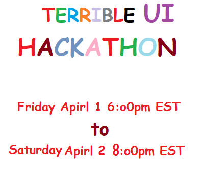

# Past

-   Nothing here yet

# Upcoming

<p align="center">
  
</p>

## Terrible UI Hackathon #1

```
When: 4/01/22 @ 6:00PM EST
Challenge: Build the worst Date/Time Selector
```

Come join us April 1 to build the worst UI features you can imagine! Inspired by the [Worst Volume Control](https://uxdesign.cc/the-worst-volume-control-ui-in-the-world-60713dc86950) competition a few years ago on reddit. Each month we'll select a new UI feature, and compete to make it as terrible as possible.

## How to join

The hackathon is hosted on Discord (https://discord.gg/kqt8RcVggN)

-   Join the server
-   Click "Events" and mark yourself as interested

Don't have discord, no problem. Just submit a PR following the #submission instructions before the deadline and you're good to go.

## Schedule

The hackathon starts Friday 4/1/22 at 6:00pm. All submissions are due Saturday 4/2/22 6:00pm.

#### Friday @ 6:00pm

    Hop on discord, introduce yourselves, work solo or with a friend.

#### Next 24 hours

    GET HACKING

#### Saturday @ 6:00pm

    Submit your solution for judging.

#### Saturday @ 8:00pm

    Join the live stream on Discord to see the winners.

## Submissions

1. Fork the repo (click the fork button)
2. Clone down the codebase
3. Create a new folder (i.e. `coolest_project`) in the `/submissions/terrible_u1_1` directory.
4. That folder should contain all the code, as well as an `about.json`. Feel free to copy the `./sample` folder to get started.

    ```
    🗀 coolest_project
        🗀 assets
        about.json
        index.html
        script.js
        style.css
    ```

    ```
    {
        "name": "sample",
        "description": "Sample solution for terrible_ui hackathon",
        "link": "https://example.com (Optional if hosted)",
        "contributors": [
            {
                "name": "Tyler Maran",
                "github": "https://github.com/tylermaran"
            }
        ]
    }
    ```

5. Push up your code

    - push changes to your local fork
        ```
        git add .
        git commit -m 'bestest ui ever'
        git pull
        git push
        ```
    - Create a pull request from your fork. You can follow these [instructions](https://docs.github.com/en/pull-requests/collaborating-with-pull-requests/proposing-changes-to-your-work-with-pull-requests/creating-a-pull-request-from-a-fork).

6. That's it!

## Problems?

Best bet is to ask in the Discord. But feel free to email tyler@rysolv.com as well. 
