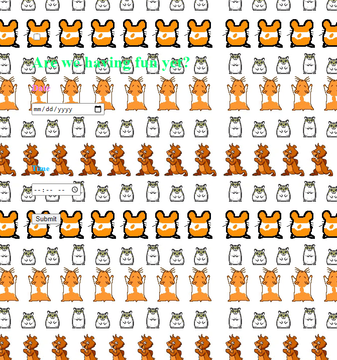
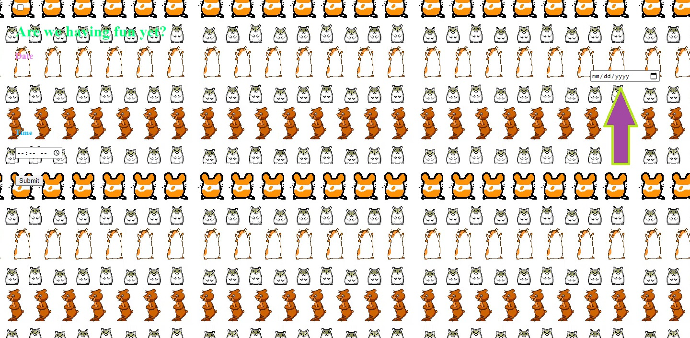
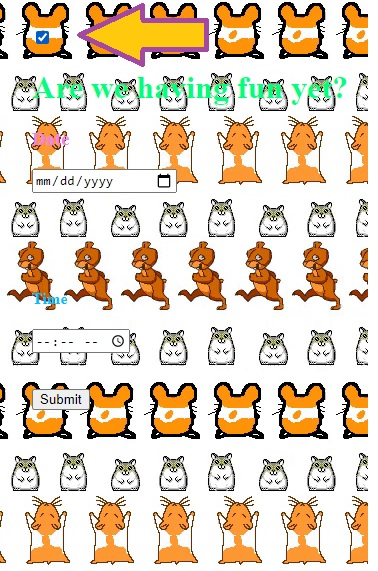

## Click Here - an exercise in futility.

Throwback to the easy days, when you had dizzying hamsters singing songs to you on a website that took all of your computer resources and 15 minutes to load. 

If you try to select the date/time/submit - they move.

You may have noticed that this is an incredibly wide image... that's because the box is pretty much out there on the screen now. If you go over to click it, it moves again. It's a slippery box.

Your best bet, if you actually want to enter a day/time, is to click here (and then tab to the boxes to fill them out) BUTTTTT

### I must warn you
The tabs are unordered.

I do my best design work in paint. Thanks for the arrows. MS Paint always out here doing us solids. 